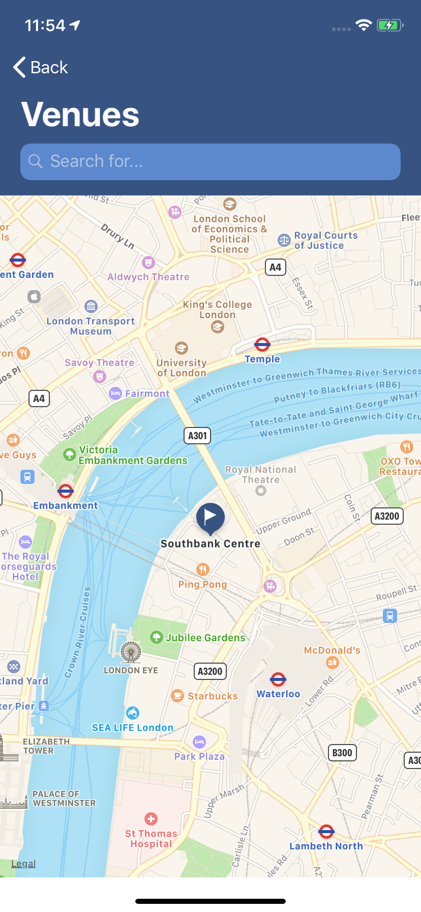
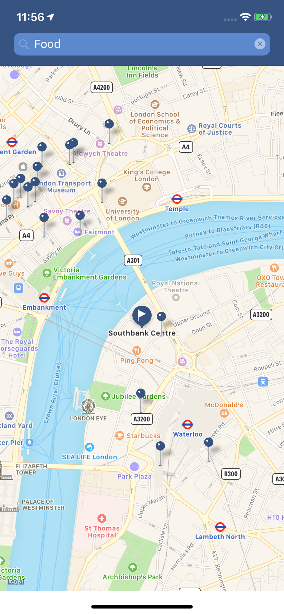
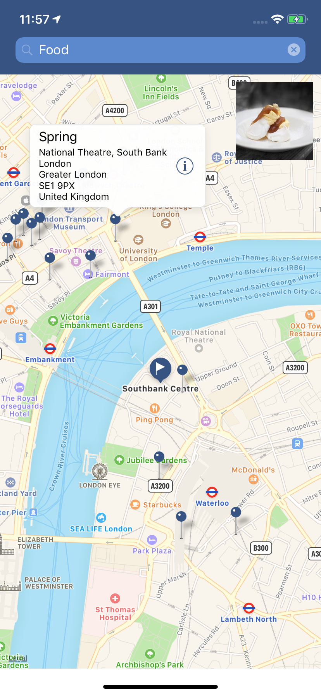

# SwiftTechnicalTaskVenuesApp
Eventogy technical task, to find most popular places nearby using FourSquare API.

## Task

Create an app that allows a user to enter a place name, submit, and then view the recommended or popular venues nearby.
The venues are provided by the FourSquare API which you can integrate with.

### Instructions:

The demonstration app should take a minimum viable product approach to show how you approach the problem with exceptional production quality code and organization (but without spending too much of your time). 

You will need to sign up as a Foursquare developer and create an app in order to use their services. Feel free to use the Foursquare public token available from trying out the API endpoints on the foursquare developer website (e.g. https://developer.foursquare.com/docs/users/search -> ’Try it out’).

### Rules:
1. Your code must be written in Swift (for iOS) and should use the most modern/recent conventions and dependencies
2. Feel free to use Google, Stack Overflow, and any other websites or tutorials for inspiration but ensure the submitted code is your own solution
3. Your code must compile and run as instructed in your readme
4. Your code must be provided in a github repository and you should frequently check-in your progress to demonstrate your incremental approach and process
5. When you submit your code you must send a summary (or have it as your readme.md) explaining the approach you have taken
6. Your code must be unit tested (optional)

## Result

### Requirements:
* Xcode 10.2 with swift 5
* Google [Places API](https://cloud.google.com/maps-platform/places/?apis=places) key  
* Foursquare [Client_ID and Client_Secret](https://developer.foursquare.com/) keys

### Usage:
The app uses both google places and foursquare api to find locations and venues based on user preferences.
The user will first need to search a desired location which will be queried and handled by google places and from that search, we will retrieve the location details of the search such as address and location coordinates.
This information will then be processed and allow us to place the user on the map to that searched location.


                  


For this to happen, you will need to get a Google Places API Key from the Google Cloud Platform by simply creating a new project on the platform and coping the API key from your project credentials.

Copy and paste the key in the GOOGLE_API_KEY enum case in this Constants file in the [VenuesModel](/VenuesApp/VenuesModel/Constants.swift) folder.

```swift
public enum Constants: String {
    case cellIdentifier = "SearchResultCell"
    case segueIdentifier = "toVenuesMap"
    case GOOGLE_API_KEY = "ENTER_GOOGLE_API_KEY"
```

Next, the user would now be able to search for an activity of interest that they would like to do at that location. This can be food, coffee, art, cinema etc... 
This search will be handled by the foursquare api which will recommend the best venues to attend based on the user activity of interest.

For this to happen, you will need to create an account with Foursquare, create a demo app and get the client_id and client_secret keys.

Copy and paste the keys in their reprective fields, in the FOURSQUARE_CLIENT_ID and FOURSQUARE_CLIENT_SECRET enum cases found in the same Constants file as the google api key.

```swift
public enum Constants: String {
    ...
    case FOURSQUARE_CLIENT_ID = "ENTER_FOURSQUARE_CLIENT_ID"
    case FOURSQUARE_CLIENT_SECRET = "ENTER_FOURSQUARE_CLIENT_SECRET"
```

Foursquare provides many options for finding venues around a given location. In our case, it helps us find venues around the searched location, and return venues based on the user activity of interest. 

After this search we get several venues (pin annotations on the map) provided by foursquare and from here we can select the venue of interest and a callout bubble will pop up showing the address of the venue. 

Futhermore, the user can tap on the callout bubble and get more information about the selected place of interest on the web.


                    


### Approaches:
* Followed Model-View-ViewModel pattern by modularising the app using different frameworks consisting of VenuesModel, VenuesViews, VenuesViewModel, including some supplementary modules such as VenuesServices and VenuesCore.
* Followed some SOLID principles such as single responsibility, open closed principle, interface segregation and dependency inversion. 
* Followed Dependency Injection principle my making some classes not responsible for handling the dependencies of their properties. A great example is the URLSessionProtocol and the injection into the HttpClient class which is reusable and testable by allowing any object that conforms to URLSessionProtocol to be injected in the class.
* Followed the Test Driven Development principle, by writing the ViewModel and Network logic first and then testing them to validate their usage.
* Followed Some design patterns such as
     - Observable pattern using NotificationCentre to fetch image data from the web and updating their UI objects once the images are retrieved and cached.
     - Singleton pattern to make one instance of the GoogleAPI and FoursquareAPI classes.
     - Decorator design pattern by extending many classed as opposed to modifying them, which didn’t break their original functionality.
     - Facade design pattern by bringing some core logic of the app into a central class. FoursquareAPI and GooglePlaceAPI classes are great examples.
* Used Decodable to decode and read data from google places and foursquare API.
* Used [weak self] in closures to break strong references between objects and avoid any retain cycles.
*  Followed the Swift style guide for code styling and added MARK:- comments in the viewcontrollers to detail the functionality of each function and property.
